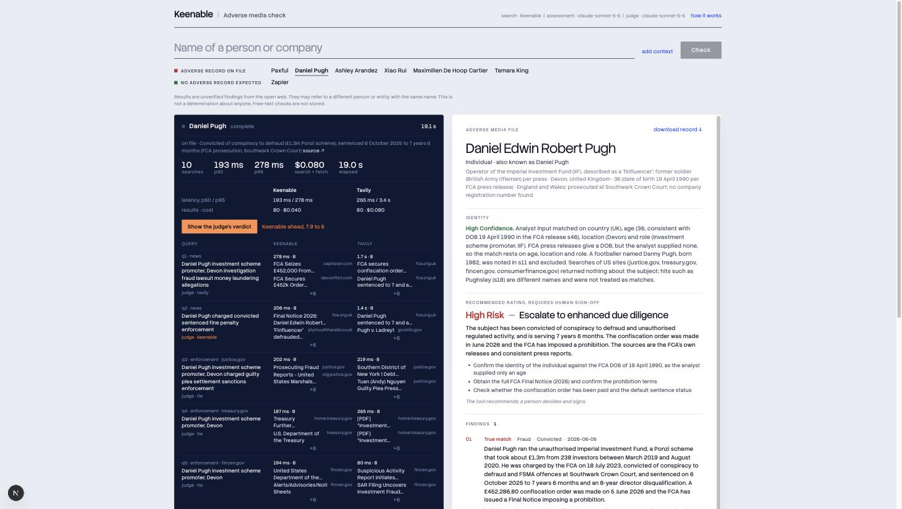
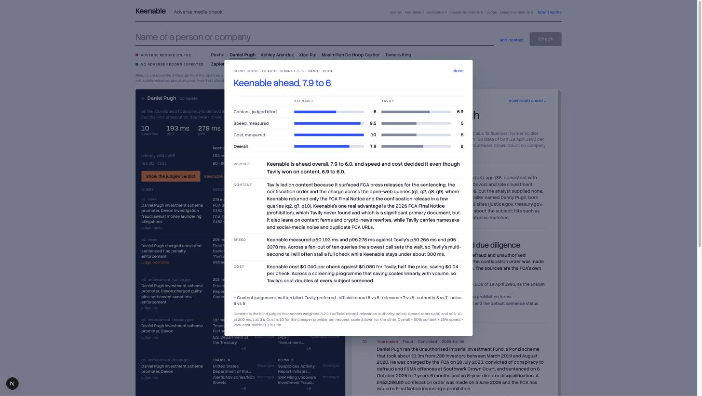

# Adverse-media check on Keenable

A demo of agentic due diligence built on [Keenable](https://keenable.ai) web search. Type a
person or company name and an agent does what a compliance analyst does at onboarding: fans out
up to ten searches across news, litigation and enforcement sites, reads the strongest pages in
full, resolves who the subject is, dispositions every hit as a true match, false positive or
inconclusive with a verbatim quote, and writes the file a reviewer would sign.

The same queries run through a second provider (Tavily by default) so the two can be compared
on the same work: latency and cost measured per call, result lists side by side, and a blind LLM
judge that scores content without knowing which provider is which.

It surfaces open-web context. It is not a sanctions list screen and it decides nothing. It is
also a simplified picture: in a real BSA/AML programme adverse media is one input among many,
next to identity verification, beneficial-ownership checks, sanctions and PEP screening, risk
scoring, transaction monitoring, enhanced due diligence, case management and SAR decisions, each
with a documented and audited process. The demo shows one step and how much faster and cheaper
it gets with the right search layer.



## Run it

```bash
cp .env.example .env.local   # add KEENABLE_API_KEY, LLM_API_KEY and, for the side by side, COMPARE_API_KEY
npm install
npm run dev                  # http://localhost:3000
```

| Variable | Purpose |
|---|---|
| `KEENABLE_API_KEY` | Keenable search and fetch ([free key, 100K requests a month](https://keenable.ai)) |
| `LLM_API_KEY` | Anthropic API key for query planning, the report and the judge |
| `LLM_MODEL` | Writes the report. Default `claude-sonnet-5-5` |
| `JUDGE_MODEL` | Blind judge for the side by side. Default `claude-sonnet-5-5`; `off` disables it |
| `COMPARE_PROVIDER`, `COMPARE_API_KEY` | Second provider: `tavily` or `exa`. The side by side shows whenever a key is set |
| `SEARCH_MODE` | `realtime` (default) or `pro` |
| `MAX_QUERIES_PER_CHECK` | Default 10 |
| `DEMO_PASSWORD` | Shared password for a deployed copy. Empty means open |
| `RATE_LIMIT_PER_10_MIN`, `GLOBAL_LIMIT_PER_HOUR` | Checks or judge calls per visitor per 10 minutes (30) and across all visitors per hour (300) |
| `LLM_EFFORT`, `QUERY_LANGUAGES`, `MAX_FETCHES_PER_CHECK` | Tuning; see `.env.example` |

## How a check runs

1. **Plan** (`lib/planner.ts`, `lib/llm.ts`). Eight fixed queries start at once: adverse news,
   criminal and regulatory terms, `site:`-restricted searches of justice.gov, treasury.gov,
   fincen.gov and consumerfinance.gov, the last twelve months, and identity. In parallel one
   model call works out whether the name is a person or a company and adds up to two more
   queries: name variants, native-script spellings, or the subject's home regulator
   (FCA, ASIC, ICAC, Singapore Police and so on).
2. **Search** (`lib/keenable.ts`). At most five calls in flight, retries on 429 and 5xx. Latency
   is measured server-side around the provider call only. Every query carries the same
   `query_time`, so the record can be re-run against the same index state. Results from both
   providers are ordered by publisher tier (official, established media, trade, unlisted)
   before anyone sees them.
3. **Read.** Full text for the ten pages most likely to settle identity and stage.
4. **Write** (`lib/llm.ts`). One structured-output call. The model sees only retrieved text,
   each item tagged with a source id. Findings and the rating stream to the page as they are
   written.
5. **Check** (`lib/pipeline.ts`). A finding is deleted unless its sources are in the retrieved
   set and its quote appears verbatim in their text. A memo sentence is deleted unless it cites
   a retrieved source or a query. What was removed is reported.

`POST /api/check` streams these steps as Server-Sent Events.

## The side by side and the judge

- **Measured:** latency p50 and p95, results returned and cost per check for both providers,
  over the same queries. Keenable at list price ($4 per 1K requests); Tavily at its credit price.
- **Blind judge** (`lib/judge.ts`, on demand from the page): the two result lists go to the
  judge labelled A and B in random order, with no provider names, latency or cost. It scores
  each on official-record recall, relevance, source authority and noise, in that priority
  order, and picks a winner per query. Then the names and the measurements are revealed and it
  writes an overall verdict in four parts: verdict, content, speed, cost.
- **Scorecard** (`lib/scorecard.ts`): content is the judge's four scores weighted 3:2:2:1;
  speed scores p50 and p95 on a log scale (10 at 200 ms, 1 at 3 s); cost is 10 for the cheaper
  provider per request, scaled for the other. Overall is 50% content, 25% speed, 25% cost. The
  formula is printed under every verdict.



## Presets

Six people and four companies, coloured on the page: red for an adverse record stated in an
official release (DOJ, FinCEN, CFPB, FCA, ICAC), green for expected clear. The adverse cases are
recent and deliberately not famous: a UK Ponzi promoter, a Hong Kong asset manager convicted of
money laundering, a Miami executive who ran a $300M laundering operation behind a sham tech
company, a New Hampshire developer who is only indicted (so the file must say "charged"), a
Massachusetts landlord who defrauded lenders with fake rent rolls, a mortgage lender under a
CFPB consent order, and a real estate company used as the vehicle for a promissory-note fraud. Each carries the official URL and the record it states;
`npm run verify:presets` fetches them live.

## Scripts

```bash
npm run check -- "Daniel Pugh"                 # one check in the terminal, prints the stream
npm run verify:presets                         # fetches each preset's official source live
npm run test:presets                           # runs every preset, writes test-results/*.md and data/cache/*.json
npm run test:presets -- --judge                # also runs the second provider and the judge
```

Run `npm run test:presets` before a demo. It refreshes the saved results the page falls back
to when a live run fails, and the table shows which presets still behave.

## What is stored

Nothing about free-text checks: not on disk, not in logs. Preset results are saved to
`data/cache/` by the test script (ignored by git). Rate limits are held in memory per instance.

## Keenable API notes (confirmed with live calls)

- Search returns `{ query, mode, results[] }` with `title, url, description, snippet,
  published_at, acquired_at`; `published_at` is missing on some results.
- Date filters accept `YYYY-MM-DD`, ISO timestamps, or relative values such as `30d` and `1y`.
- The REST response has no per-call usage data, so cost is requests × list price.
- Fetch returns `published_at` as Unix seconds; the indexed copy returns in about 130 ms.
- `realtime` mode answered every query type in about 200 ms; `pro` mode had 1 to 7 s tails on
  cold or site-restricted queries and found the same official pages, so the demo uses `realtime`.
